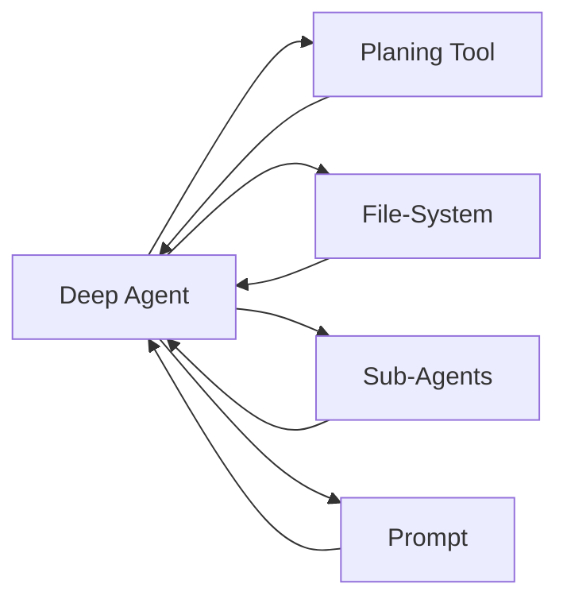

# experiments_with_llms
My leanrnings and experiments with LLMs. 

## Using Langchain
* Building my own Deep Agent using LangChain with help from LangChain Academy and Dmitry Labazkin [Project: Deep Agents with LangGraph][1]. 
    * LangChain is a software framework that helps facilitate the integration of large language models into applications. 
    * As a language model integration framework, LangChain's use-cases largely overlap with those of language models in general, including document analysis and summarization, chatbots, and code analysis.
### Quick start
```bash
# clone
git clone https://github.com/sanjaysp91/experiments_with_llms.git
cd langchain

# setup environment 
langchain % python3 -m venv .venv    # create local python environment 
langchain % source .venv/bin/activate    # activate local python environment 
langchain % python3 --version    # ensure that python version is 3.13 or above 
Python 3.13.3    # output on my terminal 
```

### Install manually and create requirements.txt for future reference 
```bash
langchain % python3 -m pip install jupyterlab    # install jupyterlab python package 
langchain % pip freeze | grep 'jupyterlab==' >> requirements.txt    # manually add a specific package to the requirements file 
langchain % cat requirements.txt    # check the file contents 
```
### Install using requirements.txt
```bash
pip install -r requirements.txt    # install python packages from file 
```

### Deep Agent Overview 
* Agents are working on (1) more general tasks, (2) over longer time horizons. 
* The lenght of tasks an AI can do it doubling every 7 months. 
* There are four central principles that are common to "deep" agents 
    * Planning: to steer agent, use todo list   
    * Offload Context (file-system): for notes, to track progress, for long-term memory 
    * Task Delegation (sub-agents): to isolate context, split context across multi-agents
    * Careful, extensive prompt engineering: decide tradeoff - generalist vs specialist   
#### Deep Agent Abstraction 

#### Workflows and Agents [Workflows and Agents][2]
* Workflows and agents are agentic systems. They are implemented using patterns. 
* This is where LangGraph comes useful offering persistence, streaming, debugging and deployment support. 

#### Workflows vs. Agents [Anthropic’s Building Effective Agents][3] 
* **Workflows** are systems where LLMs and tools are orchestrated through predefined code paths.
    * LLM is embedded in predefined code paths. 
    * LLM directs control flow through predefined code paths. 
* **Agents** are systems where LLMs dynamically direct their own processes and tool usage, maintaining control over how they accomplish tasks.
    * LLM directs its own actions based on environmental feedback. 

#### Building blocks: the augmented LLM 
* By default, LLMs don't support building workflows and agents. 
* LLMs need augmentations to orchestrate i.e. work with external entities - retrieval, memory and tools. 
* Such LLMs that can support building workflows and agents are called augmented LLMs. 
* There are various types of agentic systems. For deatils refer: [Workflows and Agents][2].
    * **Prompt chaining workflow**: In prompt chaining, each LLM call processes the output of the previous one.
    * **Parallelization workflow**: With parallelization, LLMs work simultaneously on a task. 
    * **Routing workflow**: Routing classifies an input and directs it to a followup task. 
    * **Orchestrator-Worker workflow**: An orchestrator breaks down a task and delegates each sub-task to workers. 
    * **Evaluator-optimizer workflow**: One LLM call generates a response while another provides evaluation and feedback in a loop. 
    * **Agent**: An LLM performing actions (via tool-calling) based on environmental feedback in a loop. 


### Configuration
Important config files or env vars.
- <tbd>
- <tbd>

## Contributing
Small note on how to contribute.
- Fork → branch → PR

## Contact
Author — Sanjay Patel 

## References
[1]: https://academy.langchain.com

[2]: https://langchain-ai.github.io/langgraph/tutorials/workflows/?_gl=1*1kofhy7*_gcl_au*MTY4MDEzMDg2OC4xNzYwOTAzODY5*_ga*ODU2MDE5OTM2LjE3NjA5MDM4NzA.*_ga_47WX3HKKY2*czE3NjA5NDEwNzMkbzMkZzEkdDE3NjA5NDIwNjYkajYwJGwwJGgw

[3]: https://www.anthropic.com/news/building-effective-agents